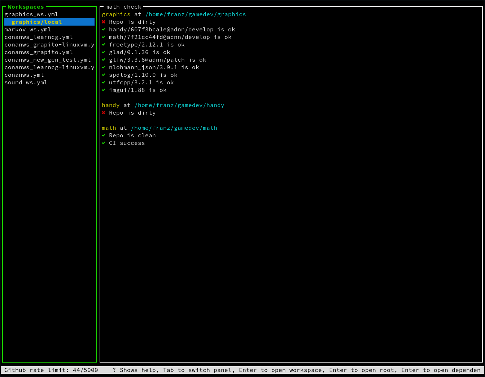
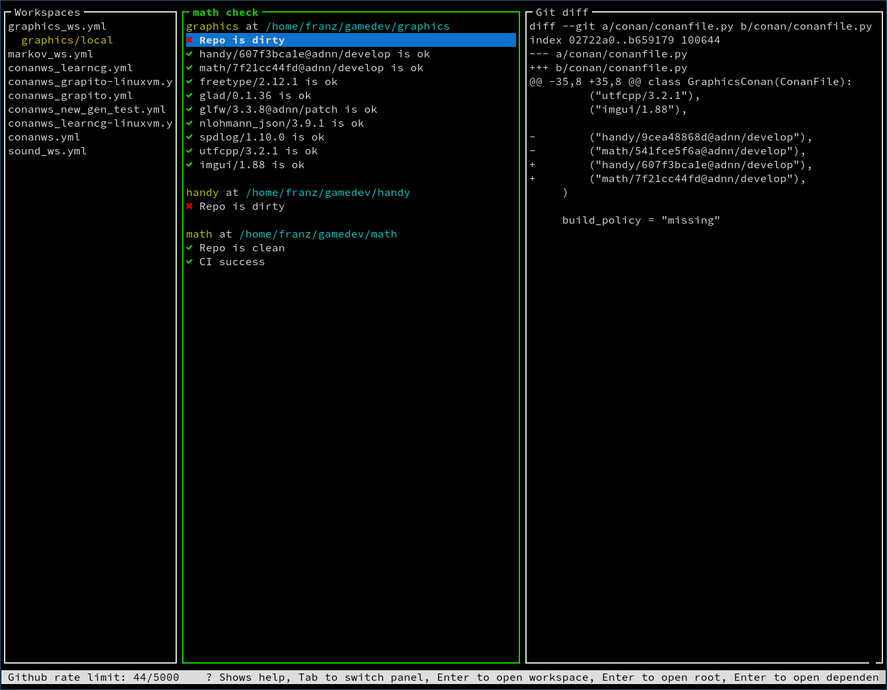
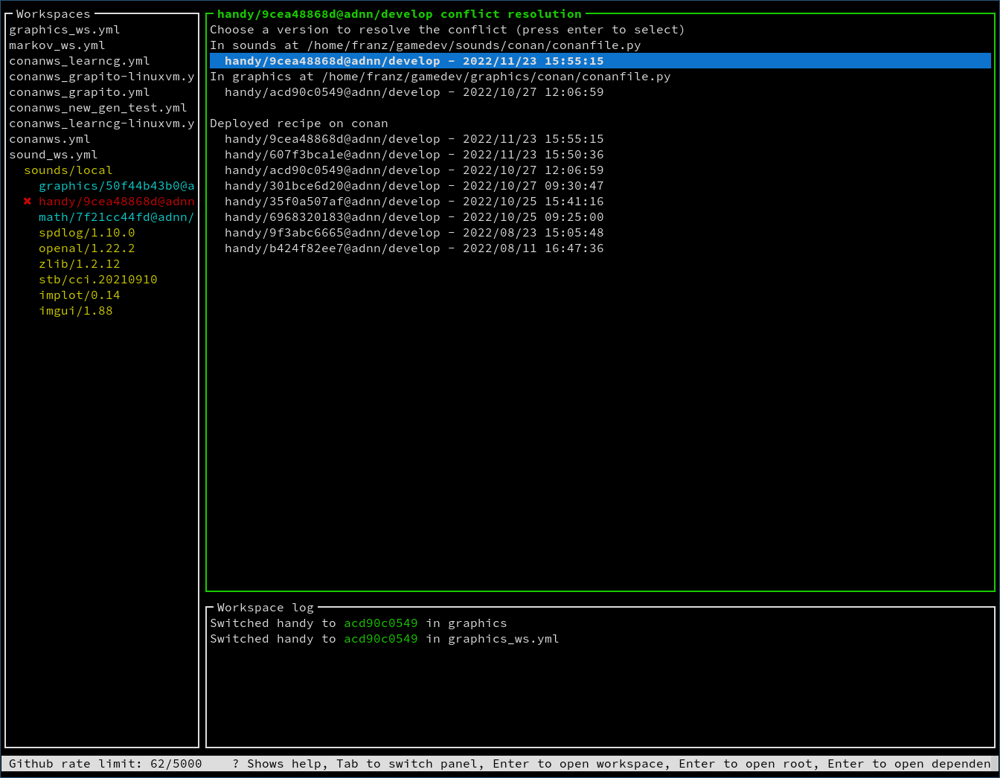

# Shred project helper
## Terminal UI
`sph tui path/to/workspace_directory``` or ```sph tui -gt github_token path/to/workspace_directory`


### Workspaces
Displays a tree structure like so:
```
Workspace
- Root 1
    - dependency with editable 1
    - dependency with editable 2
    - external dependency 1
    - external dependency 2
- Root 2
    - dependency with editable 1
    - dependency with editable 2
    - external dependency 1
    - external dependency 2
```
Hovering over a Root opens the root check status
Pressing enter over a dependency opens the conflict resolution window

### Root check status

Prints the root check status, which displays for the root and all its editable dependency their git status, CI status and dependency status.

Hovering over the git status Shows a git diff if the local git repo is dirty

### Conflict Resolution

Allows you to select the version of a dependency and propagating this choice to all editables in a workspace and to the workspace file

### Shortcuts
`?` Displays the help

`Tab` Switch the focus to the next panel

`r` Refresh the github data (updates CI status and available deployed recipe)
